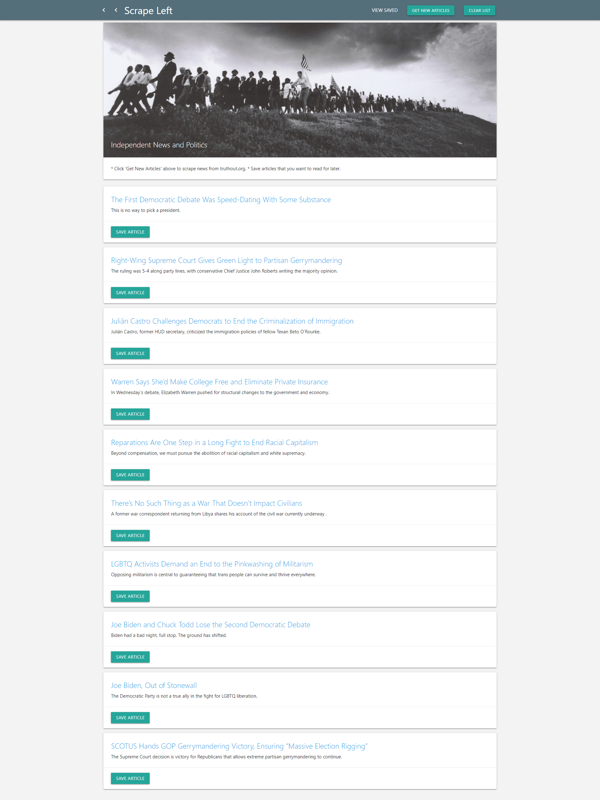
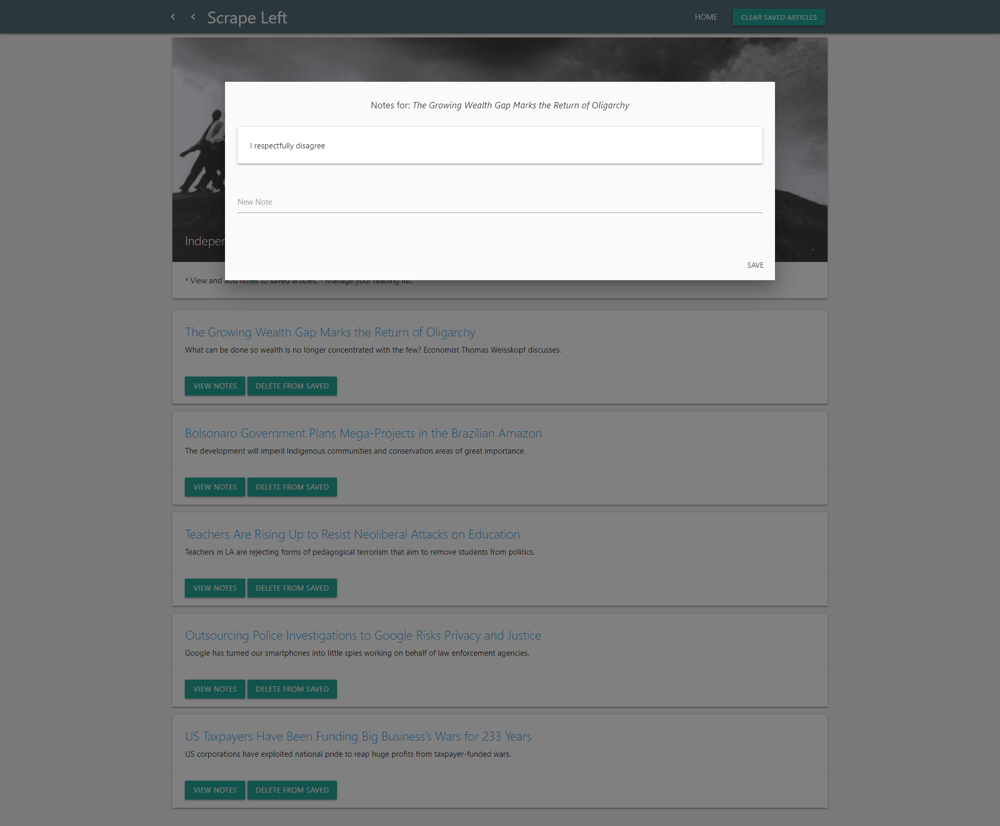

# Scrape Left (News Scraper App)
## UNC Coding Bootcamp MongoDB Homework  1-22-2019

This app allows the user to easily scrape the most recent articles from Truthout.org, save them to a database, and display them in a single list with a summary and link. Once scraped, the articles can be saved and commented on. From the Saved view, the user can add notes which are then saved and displayed with the relevant article. Articles can also be deleted.  

The deployed app can be viewed at: https://scrape-left.herokuapp.com/

The main purpose of this app is to create an aggregator that can be repurposed to scrape and save from any website that posts frequent updates. It demonstrates ability with the following tools and techniques:
  * Handlebars and HTML for web page templates and structure
  * Materialize for CSS framework
  * Node.js for Javascript runtime environment
  * Express.js for server setup and routing
  * Javascript for app logic and interactive elements
  * jQuery for additional Javascript functionality and AJAX calls to server
  * Heroku for app deployment and hosting
  * MVC design pattern for app architecture
  * MongoDB for data persistance
  * Mongoose, Cheerio, and Axios npm packages

Installation: MongoDB and required npm packages must be installed to run this app locally.

### Screenshots

